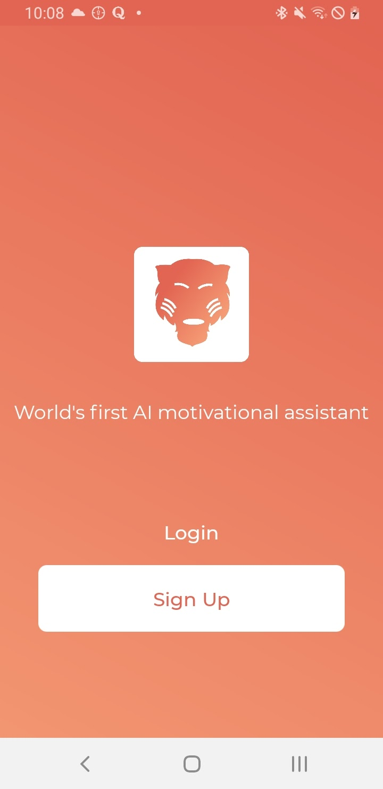
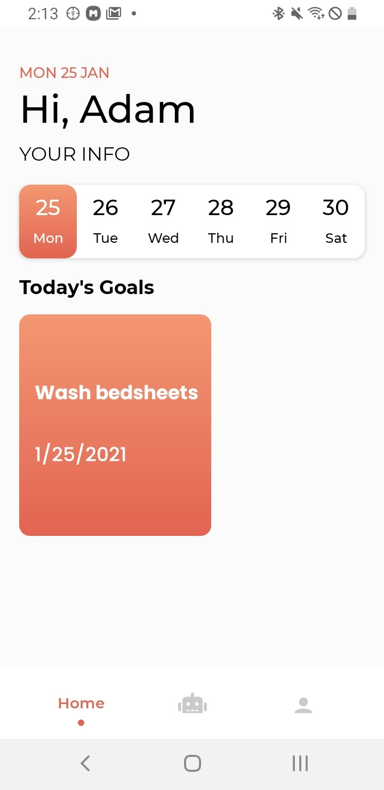

[![LinkedIn][linkedin-shield]][linkedin-url]

<!-- PROJECT LOGO -->
 

    

  <h3 align="center">Moti: AI Wellness App</h3>

## About The Project

 
 
 

During the 2020 COVID lockdown, I wanted to build a project that would not only allow me to practice my React Native skills, but provide an actual service that I needed. So, I decided to make this mobile app.

My goal was simple (sort of): build an AI-powered virtual wellness assistant, called Moti, that users can communicate with 24/7, all without the need to book an expensive therapist or other form of support. The assistant can help users form long-term goals, map user emotions, and provide motivation in times of negative mental states. 

This repository contains the frontend of the app. For the backend, check [here](https://github.com/mister36/wellness-api), and for the chatbot server, check [here](https://github.com/mister36/wellness-chatbot).

### Built With

* [React Native](https://reactnative.dev/)

<!-- CONTACT -->
## Contact

Adam Achebe -  achebeadam@gmail.com

Project Link: [https://github.com/mister36/wellness-app](https://github.com/mister36/wellness-app)

<!-- MARKDOWN LINKS & IMAGES -->
<!-- https://www.markdownguide.org/basic-syntax/#reference-style-links -->
[contributors-shield]: https://img.shields.io/github/contributors/othneildrew/Best-README-Template.svg?style=for-the-badge
[contributors-url]: https://github.com/othneildrew/Best-README-Template/graphs/contributors
[forks-shield]: https://img.shields.io/github/forks/othneildrew/Best-README-Template.svg?style=for-the-badge
[forks-url]: https://github.com/othneildrew/Best-README-Template/network/members
[stars-shield]: https://img.shields.io/github/stars/othneildrew/Best-README-Template.svg?style=for-the-badge
[stars-url]: https://github.com/othneildrew/Best-README-Template/stargazers
[issues-shield]: https://img.shields.io/github/issues/othneildrew/Best-README-Template.svg?style=for-the-badge
[issues-url]: https://github.com/othneildrew/Best-README-Template/issues
[license-shield]: https://img.shields.io/github/license/othneildrew/Best-README-Template.svg?style=for-the-badge
[license-url]: https://github.com/othneildrew/Best-README-Template/blob/master/LICENSE.txt
[linkedin-shield]: https://img.shields.io/badge/-LinkedIn-black.svg?style=for-the-badge&logo=linkedin&colorB=555
[linkedin-url]: https://www.linkedin.com/in/adam-achebe/
[product-screenshot]: images/screenshot.png
